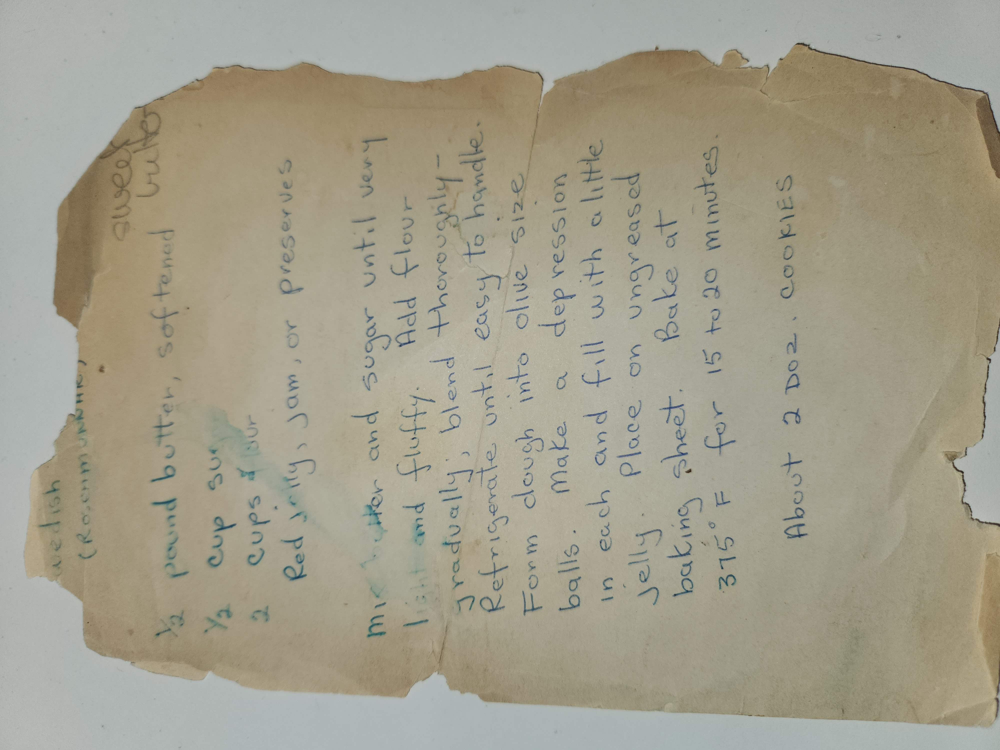

# Swedish (Rosmunbullar) Sweet Bites

## Ingredients

* ½ pound butter, softened
* ½ cup sugar
* 2 cups flour
* Red jelly, jam, or preserves

## Instructions

1. Mix butter and sugar until very light and fluffy.
2. Add flour gradually and blend thoroughly.
3. Refrigerate until dough is easy to handle.
4. Form dough into olive-size balls.
5. Make a small depression in each and fill with a little jelly.
6. Place on ungreased baking sheet.
7. Bake at 375°F for 15 to 20 minutes.

Yield: About 2 dozen cookies

