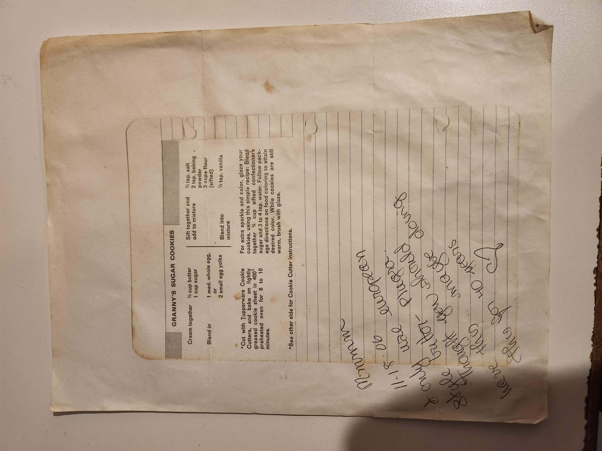

# Granny's Sugar Cookies

## Ingredients
- ½ cup butter  
- 1 cup sugar  
- 1 medium whole egg **or** 2 small egg yolks  
- ½ tsp. salt  
- 2 tsp. baking powder  
- 2 cups flour (sifted)  
- ½ tsp. vanilla  

## Directions
1. **Cream together:**  
   - ½ cup butter  
   - 1 cup sugar  

2. **Blend in:**  
   - 1 medium whole egg, or 2 small egg yolks  

3. **Sift together and add to mixture:**  
   - ½ tsp. salt  
   - 2 tsp. baking powder  
   - 2 cups flour (sifted)  

4. **Blend into mixture:**  
   - ½ tsp. vanilla  

5. Cut with cookie cutters. Place on lightly greased cookie sheet.  
6. Bake at **400°F** for **8 to 10 minutes**.  

---

## Optional Glaze
For extra sparkle and color:

- ¾ cup sifted confectioner’s sugar  
- 3 to 4 tsp. water  
- Food coloring (as desired)  

**Instructions:**  
Blend sugar and water. Add food coloring to reach desired color. While cookies are still warm, brush with glaze.  

