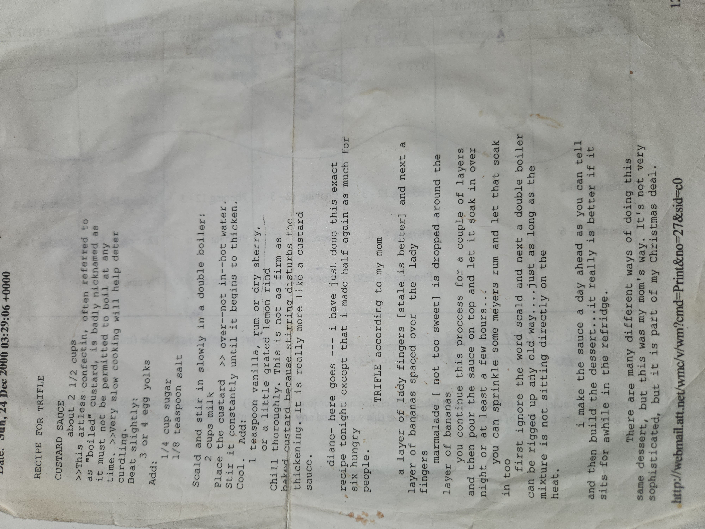

# Trifle

## Custard Sauce

This artless confection, often called “boiled custard,” must *never* actually be boiled.  
Very slow cooking helps prevent curdling.  

**Ingredients**  
- About 2 ½ cups milk  
- 3 or 4 egg yolks, slightly beaten  
- ¼ cup sugar  
- ⅛ teaspoon salt  
- 1 teaspoon vanilla, rum, or dry sherry  
- A little grated lemon rind  

**Directions**  
1. Scald the milk.  
2. Stir it slowly into the egg yolks, sugar, and salt in a double boiler.  
3. Place the custard *over* (not in) hot water. Stir constantly until it begins to thicken.  
4. Cool.  
5. Add vanilla, rum, or sherry, and lemon rind.  
6. Chill thoroughly.  

> This isn’t as firm as baked custard since stirring disturbs the thickening.  
> It’s really more like a custard sauce.  

---

## Trifle (according to my mom)

**Ingredients**  
- Ladyfingers (stale is better)  
- Bananas, sliced  
- Marmalade (not too sweet)  
- Custard sauce (from above)  
- Optional: Meyers rum  

**Directions**  
1. Lay down a layer of ladyfingers.  
2. Add sliced bananas on top.  
3. Drop marmalade around the bananas.  
4. Repeat for a couple of layers.  
5. Pour the custard sauce over everything.  
6. Let it soak overnight or at least a few hours.  
   - You can sprinkle rum and let that soak in too.  

**Notes**  
- A double boiler can be rigged up any old way, just make sure the mixture isn’t sitting directly on the heat.  
- It’s best to make the sauce a day ahead, then build the dessert and let it sit in the fridge.  
- Really, it’s better if it sits awhile.  

---

There are many different ways of doing trifle, but this was my mom’s way.  
It’s not fancy, but it’s part of my Christmas tradition. 🎄

